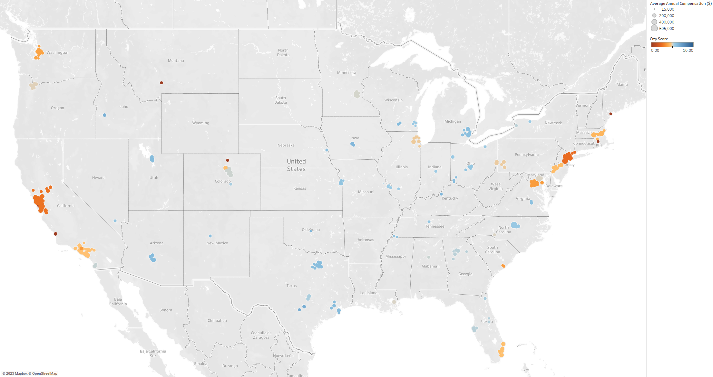

```{r setup, include=FALSE}
knitr::opts_chunk$set(echo = TRUE)
knitr::opts_chunk$set(fig.pos = "H", out.extra = "")
library(ggplot2)
library(tidyverse)
library(tidyr)
library(knitr)
library(scales)
library(stringr)
library(reshape2)
library(dplyr)
library(corrplot)
library(lubridate)
library(forcats)
library(readxl)
```
# Abstract
  In the job market, STEM fields are widely recognized as offering lucrative career opportunities, even at the entry level.  However, it is important to understand which paths within STEM are most financially rewarding.  This study investigates the common factors that significantly raise salaries in entry-level tech jobs.  This study also examines the best cities in the United States for STEM jobs, taking into account factors such as salary, cost of living, and quality of life. By analyzing data from levels.fyi, the U.S. Bureau of Labor Statistics' "Occupational Employment and Wage Statistics," and teleport.org, we identified trends and patterns in the job market. We used various visualization techniques, including categorical distributions, time series analysis, and an interactive map dashboard, to explore the data.  Our analysis revealed that managerial positions in tech jobs and individuals with graduate degrees generally came with higher salaries. Toward the second research question, we found that California, Washington, New York, and Massachusetts offer some of the highest mean and median salaries for tech jobs. Among the areas with high average salaries and good cost of living are Austin, Dallas, Raleigh, Detroit, and Phoenix.  

# 1 Introduction
  As technology continues to spread into countless parts of everyday life, it is easy to marvel at the fact that there are numerous people, teams, and organizations behind its development. While it is true that the jobs and organizations in the tech industry have become lucrative, it is also true that not all jobs are created equal in terms of salary. This raises the question about what factors contribute to the higher salaries in tech and STEM, in addition to what factors contribute to wage discrimination and quality of life for professionals. For context, some jobs in these fields could possibly pay higher salaries than others according to a multitude of factors that could include education level, years of experience, supply and demand for individuals qualified for these jobs, and many more. 
    
  The research in this project seeks to answer two questions. First, are there common factors between tech jobs that significantly raise their salary, and what are they? Finding categorical trends among the salaries of IT professionals that can provide deeper insight than the surface level stereotypes of moving upward through the corporate chain or small, startup company successes would be particularly valuable. Second, what are the best cities for STEM jobs in terms of salary, cost of living, and other quality of life factors? This question is in the same spirit as the first question in that building trends and profiles is valuable for quick information digestion. However, it differs in the sense that answering this question identifies specific tech industry hotspots that can help young professionals discover feasible paths on which to start and build their career.
    
  The answers and conclusions generated from this research and data analysis, as mentioned, will be a useful tool for a wide range of young individuals from high school students to college students and graduates to individuals looking to change careers into the tech industry. Interaction with this information can range from a detailed report to a simple web application in order to educate this demographic on the nuances behind jobs in the tech industry and STEM.


# 2 About the Data
  The first data source for this report is levels.fyi\footnote{https://www.levels.fyi}, a website used for reporting and researching salaries. This site hosts crowdsourced salary data including information such as experience, company, location, and demographic information (gender, race, and education). This data aids the discovery of any common factors of the highest paid positions in STEM careers. Additionally, the location data on this site helps determine the best cities for STEM jobs. The data from this site can be obtained in two ways. The first is through a publicly accessible JSON object which stores over 62,000 entries from 2017 and 2021. The second way is manually scraping the site with a tool like Selenium.
  
  The second source is the U.S. Bureau of Labor Statistics’ “Occupational Employment and Wage Statistics.”\footnote{https://www.bls.gov/oes/current/oes\_nat.htm} This employment data from May 2021 contains occupational and wage information for over 1,000 various jobs. These data sets are broken down by geographic region into distinct categories such as: employment per thousand jobs, annual mean wage, and location quotient. This group of datasets will serve as a foundation for determining the relationship between geographic location, occupation, and salaries. 
  
  The final source is teleport.org\footnote{https://teleport.org/cities/}, a site that calculates and reports quality of life metrics for cities across the globe. The site ranks cities in 17 categories including cost of living, commute, safety, and more. The data found on this site, which can be accessed using a public API, provides another perspective that benefits the evaluation of the best cities for STEM careers.

## 2.1 Data Scraping
  The levels.fyi site organizes salary data by job title, location, and company. The most recent 1,000 entries are available for each combination of these categories. Therefore, to acquire a large amount of data, a list of job titles was compiled from the site and a list of cities was gathered from the JSON data set. However, there was a list of 20 titles and over 700 cities which, by executing only one script on one machine, would require weeks to scrape. Therefore, scraping was limited to only the list of 20 job titles. 

  To scrape the data from the website, a Python script\footnote{https://github.com/ConnorMoorhous/STAT4410-TeamUndergrad/blob/main/scrape/levels.fyi/scrape\_titles.py} was written that utilizes Selenium, an automated testing tool, to navigate the site and record salary data. The script navigates to job title pages, accesses salary data in the form of strings stored in an HTML table, parses these strings into their individual components, and then adds the data into a data frame. Once a job title is fully scraped, a .csv file is generated with all of its entries. Once all titles were successfully scraped, another Python script was used to quickly compile these individual data sets into one. 

  While scraping ended up being successful, there were some challenges along the way. One of the first problems was addressing advertisements and hidden entries that interrupted the script. It was also quickly noticed that the levels.fyi site stopped showing salary entries after a certain number of web requests. Thus, the script had to be adjusted to detect when this happened, to wait for 5 minutes, and then to reload the page and continue scraping. Ultimately, all these challenges were overcome and over 13,000 entries were obtained. 

  To acquire data from teleport.org, a Python script\footnote{https://github.com/ConnorMoorhous/STAT4410-TeamUndergrad/blob/main/scrape/teleport/teleport.py} was written that utilizes Teleport’s developer API. The script takes a list of cities and searches for each one using the API. For each match, it grabs the city’s scores and adds them to a data frame along with the city’s name, first-level administrative division, and country. Once all cities have been searched, the data is exported as a .csv file.

# 3 Exploratory Data Analysis

## 3.1 Data Cleaning

### 3.1.1 Levels.fyi Data

  The cleaning process for the scraped levels.fyi data started with dropping columns that are not relevant to the focus of this report. The kept columns were `date`, `company`, `title`, `total_annual_compensation`, `city`, `state`, `years_of_experience`, `years_at_company`, `gender`, `race`, and `education`. The next step was to convert the `date` column to the R standard date format. After that, the strings in `title` were reformatted by replacing ‘-’ with the space character, and `total_annual_compensation` was converted to numeric after replacing ‘$’ with the empty string. 

  Next, the columns `years_of_experience` and `years_at_company` needed to be converted to numeric. The strings ‘years’ and ‘+’ were removed by substituting all lowercase letters and ‘+’ with the empty string. Then, these columns were converted into numeric type. However, some entries still contained range values with hyphens (e.g., 1-5) which were automatically replaced with NA values after this conversion. Since there is no good way to convert a range to a numeric value, these rows were dropped. Finally, the `education` column was renamed to `education_level` to avoid merging issues with the teleport data set. 

```{r,echo=FALSE, warning=FALSE}

# Cleaning levels.fyi scraped data

# import raw data and drop unwanted columns
scraped = read.csv("https://raw.githubusercontent.com/ConnorMoorhous/STAT4410-TeamUndergrad/03595283c2228c54e871bd4cf0617a5a07e6bdbe/data/raw/levels.fyi_scraped.csv")[-c(1:2, 5, 12:15)]

# convert date to date object
scraped = scraped %>% 
 mutate(date = mdy(date))

# convert format of titles
scraped$title = str_to_title(gsub("-", " ", scraped$title))

# remove dollar sign from total_annual_compensation
scraped$total_annual_compensation = as.numeric(gsub("[\\$,]", "", scraped$total_annual_compensation))

# convert experience columns to numeric
scraped$years_of_experience = as.numeric(gsub("[a-z +]", "", scraped$years_of_experience))
scraped$years_at_company = as.numeric(gsub("[a-z +]", "", scraped$years_at_company))

# drop experience entries with a range (e.g, 1-5) which were converted above to NA
scraped = scraped %>% 
  drop_na(years_of_experience) %>%
  drop_na(years_at_company)

# rename education column for consistency
scraped = scraped %>% rename(education_level = education)

```

  Similar to the scraped data, the cleaning process for the JSON levels.fyi data started with dropping irrelevant columns. Only the columns `timestamp`, `company`, `title`, `totalyearlycompensation`, `location`, `yearsofexperience`, `yearsatcompany`, `gender`, `Race`, and `Education` were kept. The next step was converting the `timestamp` column to the R standard date format and renaming the column to `date`. After that, the `location` column was separated by commas into individual `city`, `state`, and `country` columns. Since levels.fyi locations only excluded a country if they were in the United States, the NA values in `country` were replaced by ‘United States’ and then rows without ‘United States’ in country were removed. With only U.S. cities left in the data frame, the `country` column no longer served a purpose and was dropped. 

  The JSON data contained job titles outside the focus of this report. These titles (‘Human Resources’, ‘Marketing’, ‘Sales’, and ‘Recruiter’) were removed. An odd string, ‘Title: Senior Software Engineer’, was detected in the `gender` column and then replaced with ‘Unknown’. Finally, to prepare this data set to be combined with the scraped data, some columns were renamed and the column named `type` with a default value of “Unknown” was added. The columns `totalyearlycompensation`, `yearsofexperience`, `yearsatcompany`, `Race`, and `Education` were renamed to `total_annual_compensation`, `years_of_experience`, `years_at_company`, `race`, and `education_level`, respectively. 

```{r, echo=FALSE, warning=FALSE}

# Cleaning levels.fyi JSON data

# import raw data and drop unwanted columns
json = read.csv("https://raw.githubusercontent.com/ConnorMoorhous/STAT4410-TeamUndergrad/03595283c2228c54e871bd4cf0617a5a07e6bdbe/data/raw/levels.fyi_json.csv")[c("timestamp", "company", "title", "totalyearlycompensation", "location", "yearsofexperience", "yearsatcompany", "gender", "Race", "Education")]

# convert timestamp to date
json$timestamp = substr(json$timestamp, 1, 10)
json = json %>% 
  rename(date = timestamp) %>% 
  mutate(date = ymd(date))

# separate location into city, state, country
json = json %>% 
  separate(col = location, into = c("city", "state", "country"), fill = "right", sep = ", ")

# drop non US entries
json$country[is.na(json$country)] = "United States"
json = json[json$country == "United States",]

# drop country column
json = subset(json, select = -c(country))

# drop unwanted titles
badTitles = c("Human Resources", "Marketing", "Sales", "Recruiter")
json = json[!(json$title %in% badTitles),]

# fix random gender entry
json = json %>% mutate(gender = replace(gender, gender == "Title: Senior Software Engineer", "Unknown"))

# rename columns for consistency
json = json %>% 
  rename(total_annual_compensation = totalyearlycompensation,
         years_of_experience = yearsofexperience,
         years_at_company = yearsatcompany,
         race = Race,
         education_level = Education)

# add type column
json = json %>% mutate(type = "Unknown")

```

  With both the scraped and JSON levels.fyi data relatively clean, the next step was combining these data frames which was completed by appending the scraped data to the JSON data. After this, some columns still needed cleaning. The `company` column needed capitalization to be standardized. Therefore, all `company` strings were converted to title case. Additionally, entries with ‘Software Engineer’, a placeholder value on levels.fyi for entries with no company name listed, in the `company` column were replaced with ‘Unknown’. The demographic columns `gender`, `race`, and `education` also needed cleaning. For each of these, the empty string, `NA`, and ‘hidden’ were replaced with ‘Unknown’ and strings meaning the same thing (e.g., ‘Doctorate (PhD)’ and ‘PhD’) were recoded to be the same. Finally, duplicate rows were removed and the categorical (`chr`) columns were converted to factors. 

```{r, echo=FALSE}

# Combine/clean levels.fyi data

# combine
levels = rbind(json, scraped)

# standardize capitalization of companies and convert hidden companies to "Unknown"
levels = levels %>% 
  mutate(company = str_to_title(company)) %>%
  mutate(company = replace(company, company == "Software Engineer", "Unknown"))

# clean gender column
levels = levels %>%
  mutate(gender = recode(gender, 
                         "hidden" = "Unknown")) %>%
  mutate(gender = replace(gender, gender == "", "Unknown"))

# clean race column
levels = levels %>%
  mutate(race = recode(race, 
                       "hidden" = "Unknown",
                       "Hispanic" = "Hispanic / Latino",
                       "Black" = "Black or African American",
                       "Two or More Races" = "Two or More")) %>%
  mutate(race = replace(race, race == "", "Unknown"))

# clean education column
levels = levels %>%
  mutate(education_level = recode(education_level, 
                            "hidden" = "Unknown",
                            "Masters degree" = "Master's Degree", 
                            "Doctorate (PhD)" = "PhD",
                            "Bachelors degree" = "Bachelor's Degree",
                            "Some college coursework completed" = "Some College",
                            "High school or equivalent" = "Highschool",
                            "Bachelor’s degree" = "Bachelor's Degree",
                            "Master’s degree" = "Master's Degree",
                            "Technical or occupational certificate" = "Technical or Occupational Certificate"
                              )) %>%
  mutate(education_level = replace(education_level, education_level == "", "Unknown"))

# replace NA values with "Unknown"
levels = levels %>% replace_na(list(gender = "Unknown", race = "Unknown", education_level = "Unknown"))

# remove duplicates
levels = levels %>% distinct()

# convert categorical columns to factors
levels = levels %>% 
  mutate(company = as.factor(company),
         title = as.factor(title),
         city = as.factor(city),
         state = as.factor(state),
         gender = as.factor(gender),
         race = as.factor(race),
         education_level = as.factor(education_level),
         type = as.factor(type))

write.csv(levels, "data/levels.fyi.csv", row.names=FALSE)

```

### 3.1.2 BLS Occupational Employment and Wage Statistics Data
  For the data from the U.S. Bureau of Labor Statistics (BLS) concerning “Occupational Employment and Wage Statistics,” the cleaning was relatively straightforward for the three data sets—city, state, and national statistics—obtained for the year 2021.  Extraneous columns for the purpose of answering the second research question and keeping data similar to other datasets involved the hourly wages per occupation, columns that were purely categorizers for the BLS’s records, and columns that only held one value for every row entry (like “Cross-industry”). These included the columns named `NAICS`, `NAICS_TITLE`, `I_GROUP`, `PCT_TOTAL`, `PCT_RPT`, `H_MEAN`, `H_PCT10`, `H_PCT25`, `H_MEDIAN`, `H_PCT75`, `H_PCT90`, `ANNUAL`, `HOURLY`.  Additionally, since the national statistics dataset did not differ in terms of `JOBS_1000` and `LOC_QUOTIENT`, these were removed from that set specifically. 

  When cleaning the rows for missing values, the first step was to convert all wage/monetary columns to numeric type (since importing them left them as characters). This way, any rows that are non-numeric would be forced as `NA` (missing value). There is no reason to impute these values with a mean or median because there is no analytical gain. As such, these rows were dropped from the dataset in addition to any rows that did not contain the keywords ‘Software’, ‘Engineer’, ‘Product’, ‘Engineering’, ‘Architect’, ‘Solution’, ‘Data’, and ‘Mathematical’.  With that, three clean data sets were ready to be explored. 

```{r, echo=FALSE, warning=FALSE}

data.city = read_xlsx("data/raw/bls/city_M2021.xlsx", sheet=1)[,c(-5,-6,-7,-16,-17,-18,-21,-22,-23,-24,-25,-31,-32)]
data.state = read_xlsx("data/raw/bls/state_M2021.xlsx", sheet=1)[,c(-5,-6,-7,-16,-17,-18,-21,-22,-23,-24,-25,-31,-32)]
data.national = read_xlsx("data/raw/bls/national_M2021.xlsx", sheet=1)[,c(-5,-6,-7,-16,-17,-18,-21,-22,-23,-24,-25,-31,-32)]
data.national = data.national[,c(-11,-12)]

titles = c('software-engineer','product-designer','product-manager','data-scientist','software-engineering-manager','technical-program-manager','solution-architect','security-analyst','information-technologist','program-manager','project-manager','data-science-manager','product-design-manager','technical-writer','sales-engineer','biomedical-engineer','civil-engineer','hardware-engineer','mechanical-engineer','geological-engineer')
keywords = c('Software','Engineer','Product ','Engineering','Architect','Solution','Data','Mathematical')
data.city.stem = data.city[grepl(paste(keywords,collapse="|"),data.city$OCC_TITLE),]
data.state.stem = data.state[grepl(paste(keywords,collapse="|"),data.state$OCC_TITLE),]
data.national.stem = data.national[grepl(paste(keywords,collapse="|"),data.national$OCC_TITLE),]

data.state.stem = data.state.stem %>% mutate_at(c("TOT_EMP","EMP_PRSE","JOBS_1000","LOC_QUOTIENT","A_MEAN","MEAN_PRSE","A_PCT10","A_PCT25","A_MEDIAN","A_PCT75","A_PCT90"),as.numeric)
data.city.stem = data.city.stem %>% mutate_at(c("TOT_EMP","EMP_PRSE","JOBS_1000","LOC_QUOTIENT","A_MEAN","MEAN_PRSE","A_PCT10","A_PCT25","A_MEDIAN","A_PCT75","A_PCT90"),as.numeric)
data.national.stem = data.national.stem %>% mutate_at(c("TOT_EMP","EMP_PRSE","A_MEAN","MEAN_PRSE","A_PCT10","A_PCT25","A_MEDIAN","A_PCT75","A_PCT90"),as.numeric)

data.city.stem = data.city.stem %>% mutate_if(is.character, as.factor)
data.state.stem = data.state.stem %>% mutate_if(is.character, as.factor)
data.national.stem = data.national.stem %>% mutate_if(is.character, as.factor)

data.state.stem = na.omit(data.state.stem)
data.city.stem = na.omit(data.city.stem)
data.national.stem = na.omit(data.national.stem)

data.city.stem = data.city.stem[,c(-1,-3,-5,-6,-8)]
data.state.stem = data.state.stem[,c(-1,-3,-5,-6,-8)]
data.national.stem = data.national.stem[,c(-1:-5,-6,-8)]

write.csv(data.city.stem,"data/bls/city_M2021_clean.csv")
write.csv(data.state.stem,"data/bls/state_M2021_clean.csv")
write.csv(data.national.stem,"data/bls/national_M2021_clean.csv")

```
  
### 3.1.3 Teleport.org Data
The raw teleport data started in long form with columns: `city`, `admin1`, `country`, `color`, `name`, and `score_out_of_10`. Upon loading the .csv file, duplicates were removed. Next, since Teleport’s API reported NA scores as 0, 0 values were replaced with `NA` values which prevents these scores from being misinterpreted later on. Since this report’s focus is on cities in the United States, entries without U.S. cities (i.e., rows without the United States in the `country` column) were removed. The next step was to drop the `country `(it no longer served any purpose) and `color` columns. After that, the `admin1` column was renamed to `state`, the `name` column was renamed to `category`, and the `score_out_of_10` column was renamed to `score` to better represent the columns. Then, the `state` values were converted to their abbreviations to better match the cleaned levels.fyi data. 

To support mapping these cities, a subset of the US Cities Database from simplemaps.com – with selected columns: `city`, `state_id`, `lat`, `lng`, and `population` – was merged, based on city and state, with the teleport data. After this, the categorical columns `city` and `state` were converted into factors. Finally, the data set was cast into wide form with the `category` column as the variable names and the `score` column as the values. 

```{r, echo=FALSE}

#teleport = read.csv("data/raw/teleport_raw.csv")

teleport = read.csv("https://raw.githubusercontent.com/ConnorMoorhous/STAT4410-TeamUndergrad/03595283c2228c54e871bd4cf0617a5a07e6bdbe/data/raw/teleport_raw.csv")

# remove duplicates
teleport = teleport %>% distinct()

# replace 0's with NA
teleport$score_out_of_10 = replace(teleport$score_out_of_10, teleport$score_out_of_10 == 0, NA)

# remove non United States cities
teleport = teleport[teleport$country == "United States",]

# remove columns
teleport = subset(teleport, select = -c(X, country, color))

# rename columns
teleport = teleport %>% rename(state = admin1, category = name, score = score_out_of_10)

# abbreviate states
teleport$state = c(state.abb, 'DC')[match(teleport$state, c(state.name, 'Washington, D.C.'))]

# add coordinates & population
usCities = read.csv("https://raw.githubusercontent.com/ConnorMoorhous/STAT4410-TeamUndergrad/03595283c2228c54e871bd4cf0617a5a07e6bdbe/data/raw/uscities.csv")[c("city","state_id", "lat", "lng", "population")]
teleport = merge(teleport, usCities, by.x = c("city", "state"), by.y = c("city", "state_id"))

# convert categorical columns to factors
teleport = teleport %>% 
  mutate(city = as.factor(city),
         state = as.factor(state))

# convert to wide form
teleport = dcast(teleport, city + state + lat + lng + population ~ category, value.var="score", fun.aggregate = mean)

# export
write.csv(teleport, "data/teleport.csv", row.names=FALSE)

```

```{r, echo=FALSE}

# combine teleport.org and levels.fyi data
levels_tp = levels %>% left_join(teleport, by = c("city", "state"))

```
## 3.2 Data Summaries 

### 3.2.1 Levels.fyi Data
The cleaned levels.fyi dataset contains 12 columns with a total of 62,531 rows. As shown in Figure 1, the column `date` contains values from January 2018 to April 2023. The gap around early 2022 shows the divide between the scraped and JSON datasets. 

```{r, echo=FALSE, message=FALSE, nice-plot, fig.width=4, fig.height=4, fig.align='center', fig.cap="Distribution of levels.fyi entries by date."}

# date summary
ggplot(levels, aes(x=date)) +
  stat_bin(position = "identity", color = "black", fill="grey") +
  scale_x_date(breaks=date_breaks("1 year"), labels=date_format("%b %Y")) +
  labs(x = element_blank(), y = "Number of entries")

```

The numerical columns in this dataset – `total_annual_compensation`, `years_of_experience`, `years_at_company` – are shown and summarized in Table 1. 

```{r, echo=FALSE}

# numeric variables summary
summary_levels_numeric = apply(levels[c('total_annual_compensation', 'years_of_experience', 'years_at_company')], 2, function(x) {
  return(format(round(c(Min.=min(x), Median=median(x), Mean=mean(x), Max.=max(x), SD = sd(x)), 2), nsmall = 2))
})

kable(summary_levels_numeric, caption = "Numerical summary of levels.fyi data set.")

```

The other columns – `company`, `title`, `city`, `state`, `gender`, `race`, `education_level`, and `type` – are categorical factors. It is important to note that the distribution of entries in this dataset. The mast majority of jobs reported are software engineering positions, as shown in Figure 2. Additionally, most entries have unreported demographic data with over half missing race and education data. A large chunk (over 20,000) of entries are also missing gender data. However, male is the most reported gender.The distributions of these demographic variables and the rest of the categorical variables are represented as Figures 8-14 in Appendix A.
  
```{r, echo=FALSE, fig.width=4, fig.height=4, fig.align='center', fig.cap="Distribution of levels.fyi entries by job title."}

# Distribution of Title
title_count = levels %>% 
  group_by(title) %>%
  tally()

ggplot(title_count, aes(x = reorder(title, n), y = n)) +
  geom_col(position = "identity") +
  coord_flip() +
  labs(x = element_blank(), y = "Number of entries")

```

### 3.2.2 BLS Occupational Employment and Wage Statistics Data

The cleaned city BLS dataset contains 14 columns with a total of 7800 rows. In the `AREA_TITLE` column, there were 396 unique cities indicated with the most frequent one being the New York-Newark-Jersey City tri-city area at 258 counts. All states and major territories of the United States were represented in this dataset, since there were 52 unique states identified—the most frequent one was California with 5 counts. The last of the categorical factors involved occupation title, where there were 50 unique titles. The most frequent was the overarching category of Architecture and Engineering Operations at a count of 7. The remaining columns are numeric descriptors of salary data and are summarized below in Tables 2 and 3.

```{r, echo=FALSE}

# BLS City Summary Table 1
summary_data.city.stem_numeric = apply(data.city.stem[,4:9], 2, function(x) {
  return(format(round(c(Min.=min(x), Median=median(x), Mean=mean(x), Max.=max(x), SD = sd(x)), 2), nsmall = 2))
})
kable(summary_data.city.stem_numeric, caption = "City Numerical Summary 1")

```

```{r, echo=FALSE}

# BLS City Summary Table 2
summary_data.city.stem_numeric = apply(data.city.stem[,10:14], 2, function(x) {
  return(format(round(c(Min.=min(x), Median=median(x), Mean=mean(x), Max.=max(x), SD = sd(x)), 2), nsmall = 2))
})
kable(summary_data.city.stem_numeric, caption = "City Numerical Summary 2")

```
  
The cleaned state BLS dataset contains 14 columns with a total of 2059 rows. In the `AREA_TITLE` and `PRIM_STATE` columns, there were 54 unique states and territories identified. Among all states and major territories of the United States, the most frequent was Florida at 10 counts. The last of the categorical factors involved occupation title, where there were 51 unique titles. The most frequent was the overarching category of Architecture and Engineering Operations at a count of 8. The remaining columns are numeric descriptors of salary data and are summarized in Tables 9 and 10 in Appendix B.

The cleaned national BLS dataset contains 10 columns with a total of 78 rows. With no separate cities and states at the national level, there are no columns for such in the cleaned dataset. In terms of occupation title, there were 63 unique titles with the most frequent being Aerospace Engineers at a count of 2. The remaining columns are numeric descriptors of salary data and are summarized in Tables 11 and 12 in Appendix B.

### 3.2.3 Teleport.org Data

The cleaned teleport.org dataset contains 22 columns and 576 rows. The first four columns – `city`, `state`, `lat`, and `lng` – contain identifying city information (name and coordinates) for 576 U.S. cities. The next column named `population` stores each city’s estimated population. The last 17 columns, shown with summary information in Table 4, represent categories that teleport.org uses to score and evaluate cities. Scores for these categories can range from 0 to 10.
  
```{r, echo=FALSE}

# Summarize teleport.org data
summary_teleport_numeric = apply(teleport[c(6:22)], 2, function(x) {
  return(format(round(c(Min.=min(x, na.rm=TRUE), Median=median(x, na.rm=TRUE), Mean=mean(x, na.rm=TRUE), Max.=max(x, na.rm=TRUE), SD = sd(x, na.rm=TRUE)), 2), nsmall = 2))
})

kable(t(summary_teleport_numeric), caption = "Summary information for teleport.org data.")

```

## 3.3 Exploring the Data

### 3.3.1 Exploring Levels.fyi Data
To explore the first research question – that is, to find the common factors that contribute to higher paid tech salaries – different methods can be applied to the levels.fyi dataset based on classification of its variables. To determine if there is a relationship between the numerical variables, a correlation plot can be used. Figure 3 is a correlation plot for the `total_annual_compensation`, `years_of_experience`, `years_at_company`, `population` (from teleport.org dataset), and `Cost of Living` variables. This plot reveals no strong correlation between any of the variables. The highest correlated are annual compensation and years of experience with r = 0.43 which suggests a weakly correlated relationship. 

It might seem odd that `Cost of Living` is negatively correlated with `total_annual_compensation`. However, `Cost of Living` represents a score from 0 to 10, with 10 representing the better (more positive) score. That is, a lower `Cost of Living` score represents a higher cost of living. Thus, this relationship is in line with general expectations.

```{r, echo=FALSE, fig.width=8, fig.height=5, fig.align='center', fig.cap="Correlation plot of numerical variables."}

# Levels.fyi Correlation Plot
focus = select(levels_tp, total_annual_compensation, years_of_experience, years_at_company, population, 'Cost of Living')
corrplot(cor(focus, use = "pairwise.complete.obs"),
         type="upper", 
         method = "shade",
         tl.col = "black",
         addCoef.col = TRUE)

```

For the categorical variables, we can explore each one’s relationship with median and average compensation. Figure 4 shows the average and median compensation by job title. Notably, this figure reveals that the top five most paid job titles are all manager positions. Additionally, hardware and software engineers are the next highest paid positions behind them.

```{r, echo=FALSE, warning=FALSE, fig.width=6, fig.height=6, fig.align='center', fig.cap="Annual compensation by job title."}

top_paying_titles = levels_tp %>%
  group_by(title) %>%
  mutate(average = mean(total_annual_compensation)) %>%
  mutate(median = median(total_annual_compensation)) %>%
  distinct(title, average, median) %>%
  ungroup() %>%
  slice_max(average, n = 21) %>%
  pivot_longer(c(average, median))

options(scipen = 999)

ggplot(top_paying_titles, aes(x = reorder(title, value), y = value, fill = name)) +
  geom_bar(stat = "identity", position = "dodge") +
  scale_y_continuous(labels = label_number(scale_cut = cut_short_scale())) +
  coord_flip() +
  labs(x = element_blank(), y = "Annual Compensation ($)", fill = element_blank())
```

Similarly, Figure 5 shows the top ten cities with at least 25 reported jobs (for better accuracy) and Figure 15 in Appendix C shows the top ten states with the highest average and median compensation. These figures provide some insight into the best locations for high paying jobs. California stands out the most in both of these figures as a location for high compensation. Notably cities around the San Francisco Bay Area dominate the top ten list.

```{r, echo=FALSE, message=FALSE, fig.width=6, fig.height=4, fig.align='center', fig.cap="Cities with highest annual compensation (minimum 25 reported jobs)."}

# Top Paying Cities (at least 25 entries)
top_paying_cities = levels_tp %>%
  group_by(city, state) %>%
  filter(n() >= 25) %>%
  mutate(average = mean(total_annual_compensation)) %>%
  mutate(median = median(total_annual_compensation)) %>%
  mutate(full_name = paste0(city, ", ", state)) %>%
  distinct(full_name, average, median) %>%
  ungroup() %>%
  slice_max(average, n = 10) %>%
  pivot_longer(c(average, median))

ggplot(top_paying_cities, aes(x = reorder(full_name, value), y = value, fill = name)) +
  geom_bar(stat = "identity", position = "dodge") +
  scale_y_continuous(labels = label_number(scale_cut = cut_short_scale())) +
  coord_flip() +
  labs(x = element_blank(), y = "Annual Compensation ($)", fill = element_blank())

```

Figure 6 shows the top average compensation by education level. The highest paid education levels, PhD and master’s degree, are largely expected results. However, workers who completed high school or some college are performing better than those with associate’s or bachelor’s degrees, an unexpected result. This might be due to the low representation of workers with only high school or some college experience. Not including unknown entries, Figure 14 in Appendix A reveals that most individuals with a STEM job have at least a bachelor's degree.

```{r, echo=FALSE, fig.width=8, fig.height=6, fig.align='center', fig.cap="Annual compensation by education level."}

# Average Compensation by Education
top_paying_edu = levels_tp %>%
  group_by(education_level) %>%
  mutate(average = mean(total_annual_compensation)) %>%
  mutate(median = median(total_annual_compensation)) %>%
  distinct(education_level, average, median) %>%
  ungroup() %>%
  slice_max(average, n = 10) %>%
  pivot_longer(c(average, median))

ggplot(top_paying_edu, aes(x = reorder(education_level, value), y = value, fill = name)) +
  geom_bar(stat = "identity", position = "dodge") +
  scale_y_continuous(labels = label_number(scale_cut = cut_short_scale())) +
  coord_flip() +
  labs(x = element_blank(), y = "Annual Compensation ($)", fill = element_blank())

```

With recent rise of remote work, an interesting area of study is the composition of jobs that are in person, remote, or hybrid. While the reported entries for this metric is quite low, Figure 16 in Appendix C shows that among the data reported, hybrid and in-person office jobs result in a slightly higher salary than remote ones.

While the levels.fyi site stores a vast amount of salary data over the past five years, this report's research is limited by the availability of the data. Time-series analysis is of particular interest, however, this limitation in the data makes it hard to reach any solid conclusions. Figure 7 is a time series plot showing the change in average and median compensation across the whole data set. The data appears to reveal a slight decrease in compensation from 2018 to 2021. However, the sudden decrease is due to the missing data and further analysis is unreliable. For another time series plot showing the change in compensation for the top 5 most reported job titles, see Figure 17 in Appendix C.

```{r time-series-plot, echo=FALSE, warning=FALSE, fig.width=8, fig.height=4, fig.align='center', fig.cap="Annual compensation from 2018 to 2023."}

levelsByMonth = levels %>%
  mutate(month = month(date), year = year(date)) %>%
  group_by(year, month) %>%
  mutate(average = mean(total_annual_compensation)) %>%
  mutate(median = median(total_annual_compensation)) %>%
  distinct(year, month, average, median) %>%
  ungroup() %>%
  mutate(date = zoo::as.yearmon(paste(year, month), "%Y %m"))


  
ggplot(levelsByMonth %>% pivot_longer(c(average, median), values_to = "compensation"), 
       aes(x = date, y = compensation, color = name)) + 
  geom_line(size = 1) + 
  geom_point() +
  labs(y = "Annual Compensation ($)", x = element_blank(), color = element_blank())
```

### 3.3.2 Exploring Teleport.org Data

To explore the second question and find the best cities not only in terms of high salary but also other city metrics such as cost of living, a map can be used. Figure 8, a screenshot of an interactive Tableau map made with both the levels.fyi and Teleport data sets, shows cities based on both their average annual compensation and their cost of living. Cities with a higher score (a darker blue) have a better cost of living than cities with a lower score (and a darker orange). Additionally, cities with a larger circle have a higher average compensation. This map reveals that, while the San Francisco and New York areas have some of the highest salaries, they also have poor cost of living. Some cities in Texas (Austin and Dallas), North Carolina (Raleigh area), Michigan (Detroit area), and Arizona (Phoenix) might be a better choice for some trying to maximize both metrics.

```{r img-with-knitr, echo=FALSE, fig.align='center', out.width='80%', fig.cap='Map of cities by average annual compensation and cost of living.'}



```

### 3.3.3 Exploring BLS Data

Before continuing, it is important to preface with the fact of the BLS datasets being somewhat unreasonable to present visually by conventional means (distributions, boxplots, etc.). However, the simple visual format of a table containing the top ten cities and states to live in ordered by the top mean salaries accompanied by occupation title helps to answer the question of what cities are best to live in by salary with the nuance of occupation. 

```{r, echo=FALSE}

sorted_mean_salaries = order(data.city.stem$A_MEAN,decreasing=TRUE)
top10rows = head(data.city.stem[sorted_mean_salaries,],10)
colnames(top10rows) = c("AREA_TITLE","PRIM_STATE","OCCUPATION","TOT_EMP","EMP_PRSE","JOBS_1000","LQ","MEAN","MEAN_PRSE","PCT10","PCT25","MEDIAN","PCT75","PCT90")
kable(top10rows[c("AREA_TITLE","OCCUPATION","MEAN")], caption = "Mean Salary Top-Ten by City")

```

As such, Table 5 above indicates which cities are best to live in order of the mean salary. It is indicated that with the exception of the Omaha-Council Bluffs area, Architectural and Engineering managers (which is an overarching group of numerous professions in the categorization of the BLS) are the ones who will likely experience this in the listed areas. More exploration and summary needs to be done on an occupational basis to determine the distribution in the cities given in the BLS dataset. A map-like visualization would be ideal for exploring this data.

```{r, echo=FALSE}

sorted_median_salaries = order(data.city.stem$A_MEDIAN,decreasing=TRUE)
top10rows = head(data.city.stem[sorted_median_salaries,],10)
colnames(top10rows) = c("AREA_TITLE","PRIM_STATE","OCCUPATION","TOT_EMP","EMP_PRSE","JOBS_1000","LQ","MEAN","MEAN_PRSE","PCT10","PCT25","MEDIAN","PCT75","PCT90")
kable(top10rows[c("AREA_TITLE","OCCUPATION","MEDIAN")], caption = "Median Salary Top-Ten by City")

```

When doing the same analysis as before on the median annual salary, however, more STEM fields are indicated as shown in Table 6. With how close the mean and median salaries are to each other, a more in-depth visualization of distributions for the most common occupations and least common occupations would be interesting.

```{r, echo=FALSE}

sorted_employment_salaries = order(data.state.stem$TOT_EMP,decreasing=TRUE)
top10rows = head(data.state.stem[sorted_employment_salaries,],10)
colnames(top10rows) = c("AREA_TITLE","PRIM_STATE","OCCUPATION","TOT_EMP","EMP_PRSE","JOBS_1000","LQ","MEAN","MEAN_PRSE","PCT10","PCT25","MEDIAN","PCT75","PCT90")
kable(top10rows[c("AREA_TITLE","OCCUPATION","TOT_EMP","LQ","MEAN")], caption = "Highest Employment Areas by State")

```

Shown in Table 7, the high number of employment in California, Texas, New York, Florida, Virginia, Washington (state), Illinois, and Pennsylvania in the areas of computer and mathematical operations—with respect to data science, analysis, and management and also software engineering and management—indicate they are states where such skilled individuals are in high demand. With the location quotient also all being close to or above 1, these states (collectively) likely make up the majority of employment locations in these fields. Moreover, it is interesting to see that mean salary generally increases among this list of top ten employment areas as the location quotient also increases.

```{r, echo=FALSE}

sorted_salaries = data.state.stem[order(-data.state.stem$A_MEAN,data.state.stem$LOC_QUOTIENT),]
top10rows = head(sorted_salaries,10)
colnames(top10rows) = c("AREA_TITLE","PRIM_STATE","OCCUPATION","TOT_EMP","EMP_PRSE","JOBS_1000","LQ","MEAN","MEAN_PRSE","PCT10","PCT25","MEDIAN","PCT75","PCT90")
kable(top10rows[c("AREA_TITLE","OCCUPATION","TOT_EMP","LQ","MEAN")], caption = "Highest Annual Salaries Among Lowest Employment Totals")

```

This last exploration was interesting due to the widely varied location quotient. Because there is little trend between occupation title and location quotient (and the mean and median salaries were in the middle range around $150,000), understanding the discrepancy as to why some areas are more saturated than others could lead to a better understanding of why some states flourish in STEM and data science in comparison to others. For example, Architectural and Engineering Managers category varied widely in location quotient while staying in a relatively similar mean annual salary range.

### 3.3.4 Salary Explorer

  The diverse nature of the levels.fyi salary data set makes it difficult to examine all angles of the data. The several categorical variables – including title, gender, education, etc. – combined with the geospatial and temporal data create a rich data set primed for exploration. To facilitate the exploration of this dataset, we created Salary Explorer, a web application for investigating the best cities for science, technology, engineering, and mathematics careers.  

  Salary Explorer\footnote{https://connormoorhous.shinyapps.io/salaryexplorer/} is an interactive application that presents an overview of different STEM job salaries for different locations. The app allows users to select a time range, one or more titles, and any combination of education levels, races, or genders to filter the levels.fyi data and present a more specialized overview.  

  The app’s first page provides a national overview of the data. The page displays national summary data – median salary, average salary, and the number of jobs reported – for the user’s selections. The page also displays an interactive time-series plot showing how this summary data has changed over time. 

  The app also hosts two other pages for the user to explore the data by state and city. The state page features an interactive table and map. The table displays median compensation, average compensation, and reported jobs for each state and can be filtered and sorted by each of these metrics. The map shows a coloring of the states based on median compensation and has a hover tooltip that includes the same information as the table. The user can select a state from the table or the map to focus on which displays the time series plot for the data. 

  The city page is similar to the state page, including both an interactive table and an interactive map displaying the same information. The cities can also be selected to display the time-series plot and a bar chart displaying the selected city’s Teleport.org scores for different quality of life categories. 

  While Salary Explorer provides a great overview of salaries across the country, the application still has several areas for improvement. The maps could benefit from the ability to switch the type of information displayed and the Teleport.org bar chart could use more context explaining what the categories are and how their scores were calculated. Salary explorer would also benefit from a comparison feature that allows users to easily compare salaries for different titles and demographic information. Lastly, the biggest area in need of improvement is the data itself. The entire levels.fyi data set was unavailable for this project due to a paywall and limitations of scraping. Having access to this entire data set would likely make product more accurate and would provide essential context for time-series analysis. 

# 4 Findings
## 4.1 Common Factors Behind High Paying Jobs
  Regarding the question “Are there common factors between tech jobs that significantly raise their salary, and what are they?”, there are indeed common factors that raise tech job salary. These include having a managerial role and an advanced degree. Additionally, there is a positive relationship between years of experience and total annual compensation. Specific jobs that commonly have high salaries include Architectural and Engineering Managers in addition to Aerospace Engineers based on mean and median salary by city. 

## 4.2 Best Cities
Regarding the question “What are the best cities for STEM jobs in terms of salary and cost of living?”, a few cities were identified in the San Francisco Bay Area, Seattle Area, and New York Area. In the San Francisco Bay Area, Los Gatos, Mountain View, Cupertino, San Francisco, and Sunnyvale were indicated as best by solely salary. Similarly, Kirkland and Seattle were identified for the same in Washington, while New York City was identified for the same in New York. Finally, when considering both salary and cost of living, Austin, Dallas, Raleigh, Detroit, and Phoenix were identified as cities with tech jobs that satisfy both categories sufficiently. 

## 4.3 Interesting Findings
Most of the findings of this report are largely expected. However, there was one interesting finding in the data. As shown in Figure 6, those with only high school diplomas or some college had a higher median and average compensation than those with bachelor's or associate degrees. This might be due to a relatively small number of entries for high school, some college, and associate degrees, which was found in Figure ?. Also, it is important to note that the distribution of jobs among education levels suggests that a bachelor’s degree is needed to get a STEM job in the first place. There are way more job entries for people with a bachelor’s degree than those with only high school diplomas, some college, or an associate degree. 

## 4.4 Challengs & Limitations
Some limitations of our analysis is the fact that there are skewed types of data collected from levels.fyi. A large amount of the data collected was from software engineers or software engineering managers. This is unfortunate because the tech job field is extremely diverse, and having the data saturated by one specific field of STEM is detrimental to coming to better conclusions. Secondly, a majority of the data from levels.fyi is embodied by the top five software engineering companies. (FAANG is an acronym that embodies the most popular large tech companies: Facebook, Amazon, Apple, Google/Alphabet, and Microsoft). Again, this limits the scope of conclusions and recommendations. 

Moreover, there were a large amount of unknown values for work type, education level, and race that limited conclusions further. More data was missing from late 2021 to early 2023 due to not having access to the full dataset behind level.fyi’s paywall and not being able to scrape more data due to the limitations of the scraping process and the data actually available on the website. This limited the time series analysis and overall accuracy of the research.

# 5 Conclusions
  In conclusion, the research presented in this project sheds light on key factors that contribute to higher salaries in tech and STEM fields, in addition to best cities for professionals in these industries. The findings provide valuable insight for individuals at different stages of their careers, ranging from high school students to college students and those looking to change careers. The data used in this research came from various sources, including levels.fyi, U.S. Bureau of Labor Statistics’ “Occupational Employment and Wage Statistics,” and teleport.org. Data cleaning was performed to remove irrelevant columns and summarize the remaining data. Data exploration was conducted through distributions across categories, time series analysis, and an interactive dashboard of tech jobs and their salaries across the United States by city and state. Managerial roles and having an advanced degree among a few other factors contributed most to an increase in salary. Cities were identified in the San Francisco Bay Area, Seattle Area, and New York City Area as locations for positions with solely high salaries in tech jobs. Now, if both high salary and low cost of living are considered, then Austin, Dallas, Raleigh, Detroit, and Phoenix would be more appropriate. 

  Overall, this research provides valuable insights into the tech industry and STEM fields, and it offers a practical tool for individuals who are interested in pursuing careers in these fields. By understanding the nuances behind jobs in the tech industry and STEM, young professionals can better position themselves for successful careers in this rapidly growing field. 

  In the future, the primary improvement should largely involve finding data sets with more thorough and diverse STEM fields than solely Software Engineering. While the data collected hints at the popularity of this field and a collective willingness to share its lucrativeness, the scope of conclusions was severely limited as a result. Regarding the data product, an improvement to the breadth of data that the map can show would be impressive. An ability or set of features to show more time series data relevant to high school or college students regarding fields of interest would be extremely beneficial to the power of the tool in providing more holistic guidance to the user. 
  
\newpage

# Appendix A

```{r, echo=FALSE, fig.width=4, fig.height=4, fig.align='center', fig.cap="Distribution of top 15 companies."}

# Distribution of Company
company_count = levels %>% 
  group_by(company) %>%
  tally() %>%
  slice_max(n, n=15)

ggplot(company_count, aes(x = reorder(company, n), y = n)) +
  geom_col(position = "identity") +
  coord_flip() +
  labs(x = element_blank(), y = "Number of entries")

```

```{r, echo=FALSE, fig.width=4, fig.height=4, fig.align='center', fig.cap="Distribution of top 15 cities with most reported jobs."}

# Distribution of City
city_count = levels %>% 
  group_by(city, state) %>%
  tally() %>%
  ungroup() %>%
  slice_max(n, n=15)

ggplot(city_count, aes(x = reorder(city, n), y = n)) +
  geom_col(position = "identity") +
  coord_flip() +
  scale_x_discrete(labels = paste0(city_count$city, ", ", city_count$state)) +
  labs(x = element_blank(), y = "Number of entries")

```

```{r, echo=FALSE, fig.width=6, fig.height=4, fig.align='center', fig.cap="Distribution of top 15 states with most reported jobs."}

# Distribution of State
state_count = levels %>%
  group_by(state) %>%
  tally() %>%
  slice_max(n, n=15)

ggplot(state_count, aes(x = reorder(state, n), y = n)) +
  geom_col(position = "identity") +
  coord_flip() +
  labs(x = element_blank(), y = "Number of entries")

```

```{r, echo=FALSE, fig.width=6, fig.height=4, fig.align='center', fig.cap="Distribution of levels.fyi entries by gender."}

# Distribution of Gender
ggplot(levels, aes(x = fct_rev(fct_infreq(gender)))) +
  geom_bar(position = "identity") +
  coord_flip() +
  labs(x = element_blank(), y = "Number of entries")

```

```{r, echo=FALSE, fig.width=6, fig.height=4, fig.align='center', fig.cap="Distribution of levels.fyi entries by race."}

# Distribution of Race
ggplot(levels, aes(x = fct_rev(fct_infreq(race)))) +
  geom_bar(position = "identity") +
  coord_flip() +
  labs(x = element_blank(), y = "Number of entries")

```

```{r, echo=FALSE, fig.width=6, fig.height=4, fig.align='center', fig.cap="Distribution of levels.fyi entries by education level."}

# Distribution of Education
ggplot(levels, aes(x = fct_rev(fct_infreq(education_level)))) +
  geom_bar(position = "identity") +
  coord_flip() +
  labs(x = element_blank(), y = "Number of entries")

```

```{r, echo=FALSE, fig.width=6, fig.height=4, fig.align='center', fig.cap="Distribution of levels.fyi entries by work type."}

# Distribution of Type
ggplot(levels, aes(x = fct_rev(fct_infreq(type)))) +
  geom_bar(position = "identity") +
  coord_flip() +
  labs(x = element_blank(), y = "Number of entries")

```

\newpage

# Appendix B

```{r, echo=FALSE}

summary_data.state.stem_numeric = apply(data.state.stem[,4:9], 2, function(x) {
  return(format(round(c(Min.=min(x), Median=median(x), Mean=mean(x), Max.=max(x), SD = sd(x)), 2), nsmall = 2))
})
kable(summary_data.state.stem_numeric, caption = "State Numerical Summary 1")

```

```{r, echo=FALSE}

summary_data.state.stem_numeric = apply(data.state.stem[,10:14], 2, function(x) {
  return(format(round(c(Min.=min(x), Median=median(x), Mean=mean(x), Max.=max(x), SD = sd(x)), 2), nsmall = 2))
})
kable(summary_data.state.stem_numeric, caption = "State Numerical Summary 2")

```

```{r, echo=FALSE}

summary_data.national.stem_numeric = apply(data.national.stem[,2:6], 2, function(x) {
  return(format(round(c(Min.=min(x), Median=median(x), Mean=mean(x), Max.=max(x), SD = sd(x)), 2), nsmall = 2))
})
kable(summary_data.national.stem_numeric, caption = "National Numerical Summary 1")

```
```{r, echo=FALSE}

summary_data.national.stem_numeric = apply(data.national.stem[,7:10], 2, function(x) {
  return(format(round(c(Min.=min(x), Median=median(x), Mean=mean(x), Max.=max(x), SD = sd(x)), 2), nsmall = 2))
})
kable(summary_data.national.stem_numeric, caption = "National Numerical Summary 2")

```

\newpage

# Appendix C

```{r, echo=FALSE, fig.width=6, fig.height=4, fig.align='center', fig.cap="States with highest annual compensation (minimum 25 reported jobs)."}

# Top Paying States (at least 25 entries)
top_paying_states = levels_tp %>%
  group_by(state) %>%
  filter(n() >= 25) %>%
  mutate(average = mean(total_annual_compensation)) %>%
  mutate(median = median(total_annual_compensation)) %>%
  distinct(state, average, median) %>%
  ungroup() %>%
  slice_max(average, n = 10) %>%
  pivot_longer(c(average, median))

ggplot(top_paying_states, aes(x = reorder(state, value), y = value, fill = name)) +
  geom_bar(stat = "identity", position = "dodge") +
  scale_y_continuous(labels = label_number(scale_cut = cut_short_scale())) +
  coord_flip() +
  labs(x = element_blank(), y = "Annual Compensation ($)", fill = element_blank())

```

```{r, echo=FALSE, fig.width=6, fig.height=4, fig.align='center', fig.cap="Average annual compensation by job location type."}

# Average Compensation by Type
top_paying_type = levels_tp %>%
  group_by(type) %>%
  mutate(average = mean(total_annual_compensation)) %>%
  mutate(median = median(total_annual_compensation)) %>%
  distinct(type, average, median) %>%
  ungroup() %>%
  slice_max(average, n = 10) %>%
  pivot_longer(c(average, median))

ggplot(top_paying_type, aes(x = reorder(type, value), y = value, fill = name)) +
  geom_bar(stat = "identity", position = "dodge") +
  scale_y_continuous(labels = label_number(scale_cut = cut_short_scale())) +
  coord_flip() +
  labs(x = element_blank(), y = "Annual Compensation ($)", fill = element_blank())

```

```{r time-series-plot-titles, echo=FALSE,  fig.width=10, fig.height=6, fig.cap="Annual compensation of top reported titles over time. "}

levelsByTitle = levels %>% 
  mutate(month = month(date), year = year(date)) %>%
  filter(title %in% c('Software Engineer', 'Product Manager', 'Software Engineering Manager', 'Data Scientist', 'Hardware Engineer'), ) %>%
  group_by(title, month, year) %>%
  mutate(average = mean(total_annual_compensation)) %>%
  mutate(median = median(total_annual_compensation)) %>%
  distinct(title, year, month, average, median) %>%
  ungroup() %>%
  mutate(date = zoo::as.yearmon(paste(year, month), "%Y %m"))

ggplot(levelsByTitle %>% pivot_longer(c(average, median)), aes(x = date, y = value, color = title)) +
  geom_line() +
  geom_point() +
  facet_wrap(~name, ncol = 1) +
  labs(y = "Annual Compensation ($)", x = element_blank(), color = element_blank())

```
